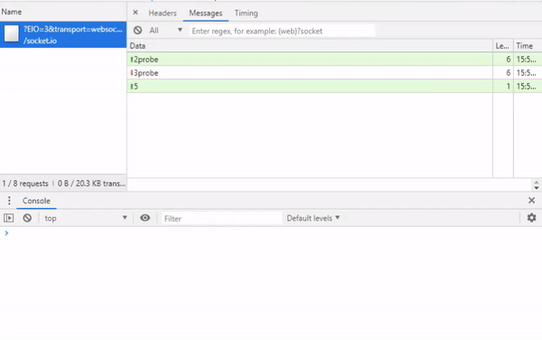

# Youtube API Websocket for Realtime Updates
<table>
<tr>
<td>
Websocket Server to push out Youtube Channel Data and Statistics in Realtime. Free to use for everyone!  🖨
This Websocket let clients connect to rooms (Youtube Channel IDs) for every youtuber they want. In this rooms they get constant updates about channel statistics and data!
Users can only be connected to one room, but also they can switch between each room.
</tr>
</table>

## :warning: VERY IMPORTANT:warning:
<table>
<tr>
<td>
This application is for private or educational purposes only. You should use the official Youtube Data API: https://developers.google.com/youtube/v3/.
We do not accept responsibility for banned accounts or penalties of any kind caused by the use of this script. We would like to point out that using this script violates the Terms and Conditions. By using the script, you automatically accept that you yourself are criminally responsible for yourself and you are aware that it violates the guidelines.
</td>
</tr>
</table>


## Example Output
Example output for PewDiePie Statistics. In this example the client is connected to the room: UC-lHJZR3Gqxm24_Vd_AJ5Yw (PewDiePies Channel ID). Note: Gif Output is just an example. It can be different in newer versions of this repo!




## How to start?
Download this project into you folder and run
```
npm install
```
After that run index.js file to start the websocket
```
node index.js
```
Now your Websocket is running and listen to port 3000


## How to connect client to websocket?
First import socket.io js file in your project for example like this
```javascript
<script src="https://cdnjs.cloudflare.com/ajax/libs/socket.io/2.2.0/socket.io.js"></script>
```
Now connect to your socket 
```javascript
var socket = io('localhost:3000');
```
Connect to a youtuber room (Just put any channelID of the youtuber you want). Same function if you want to switch to another youtuber
```javascript
socket.emit('room', 'UC-lHJZR3Gqxm24_Vd_AJ5Yw');
```
Get Channel Data of this room. Just pass the same channelID to this function
```javascript
socket.on('UC-lHJZR3Gqxm24_Vd_AJ5Yw', function(channeldata) {
   console.log(channeldata); // object with channel data :-)
});
```


## Donation [](https://www.paypal.me/LukasReiner/) 
If this project help you reduce time to develop, you can give me a cup of coffee (or a Beer of course) :)

[](https://www.paypal.me/LukasReiner/) 


## Git - Fork

```
$ git clone https://github.com/lreiner/YT-API-Websocket-NodeJS
```
When you fork a project in order to propose changes to the original repository, you can configure Git to pull changes from the original, or upstream, repository into the local clone of your fork.</br >
[Click here to see how to keep a fork synched](https://help.github.com/articles/fork-a-repo/)

## Releases

Too see all published releases, please take a look at the [tags of this repository](https://github.com/lreiner/YT-API-Websocket-NodeJS/tags).
